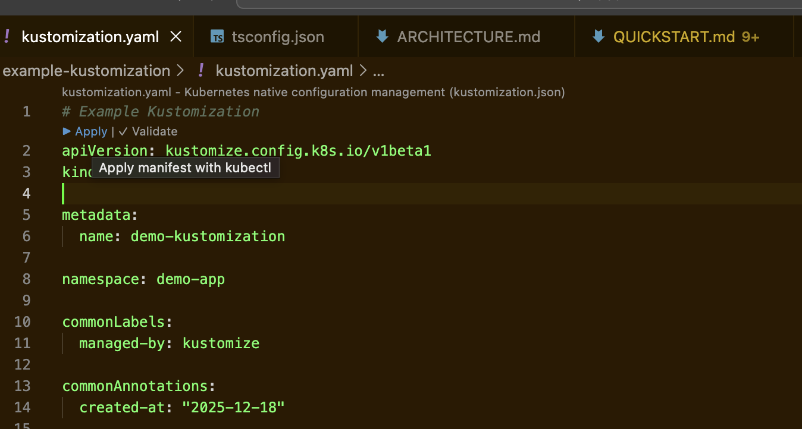

# Kubernetes Manifest Applier Extension

[](https://github.com/ianlintner/kubernetes-apply-vscode/actions/workflows/node-ci.yml)
[](https://github.com/ianlintner/kubernetes-apply-vscode/actions/workflows/docs-check.yml)
[](https://github.com/ianlintner/kubernetes-apply-vscode/actions/workflows/docs.yml)
[](https://github.com/ianlintner/kubernetes-apply-vscode/actions/workflows/publish.yml)

Apply and validate Kubernetes manifests (and Kustomize builds) directly from VS Code with a couple of clicks.




- **Code Lens buttons** in YAML files: Apply or validate instantly
- **Explorer & editor menus**: Apply/validate manifests; build/apply kustomizations
- **Manifest detection**: Auto-detects Kubernetes resources and `kustomization.yaml`
- **Dry run** and **context/namespace** options respected
- **Output channel** for detailed command logs and notifications

## Documentation

Full documentation lives at **<https://ianlintner.github.io/kubernetes-apply-vscode/>** and is built with MkDocs.

- [Getting Started](https://ianlintner.github.io/kubernetes-apply-vscode/getting-started/)
- [Usage](https://ianlintner.github.io/kubernetes-apply-vscode/usage/)
- [Architecture](https://ianlintner.github.io/kubernetes-apply-vscode/architecture/)
- [FAQ](https://ianlintner.github.io/kubernetes-apply-vscode/faq/)

## Quick start (local)

```bash
npm install
npm run compile
npm test
```

Launch the extension with **F5** in VS Code, open a manifest, and use the gutter buttons.

## Requirements

- `kubectl` (required)
- `kustomize` (optional, for kustomization build/apply)

## Publishing

See `PUBLISHING.md` for Marketplace setup and the GitHub Actions release workflow.

## License

MIT
