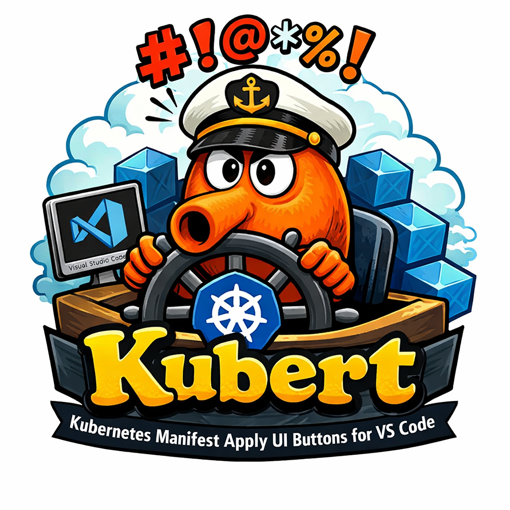

# Kubert Manifest Applier

Apply Kubernetes and Kustomize manifests directly from VS Code with one-click actions.

## Highlights

- **Code Lens actions**: "▶ Apply" and "✓ Validate" buttons in YAML editors.
- **Context menus**: Apply/validate manifests and build/apply Kustomize from the explorer.
- **Manifest detection**: Auto-detects Kubernetes resources, multi-document YAML, and kustomization files.
- **Dry run mode**: Validate changes without applying.
- **Context & namespace selection**: Respect workspace settings.
- **Output channel**: Dedicated logs and notifications for every command.

## What you can do

- Apply or validate a manifest file without leaving the editor.
- Build or apply a `kustomization.yaml` folder in one click.
- Inspect command output and errors in the "Kubernetes Manifest Applier" output channel.

## Quick links

- [Getting Started](getting-started.md)
- [Usage](usage.md)
- [Architecture](architecture.md)
- [Implementation Notes](implementation.md)
- [FAQ & Troubleshooting](faq.md)
